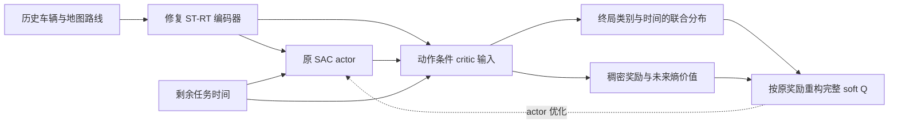

# sorted/depart4：奖励判断、近期文献与下一条技术路线

日期：2026-10-03。性质：基于已有实验的研究判断和待验证方法设计；不是新实验结果或投稿承诺。仅使用已有日志、公开论文及一个合成有限MDP的数值恒等式检查；本轮未运行SUMO、冻结诊断评估或新的完整训练。

## 1. 当前证据支持什么

主场景固定为 `intersection_sorted_depart4p0`。下表均为各自seed0从零100000 raw steps后100个validation回合（10000–10099）的历史结果；没有多训练种子稳定性证据。旧ST评估的raw reward与后来v2 shaped return不同，不横比return数值。场景结局口径及历史源码归档局限见[原分场景汇总](intersection_experiment_summary_20261001.md)及[修复对照证据](d1_contractfix_comparison_evidence_20261003.md)。

| 方法 | 成功 | 碰撞 | 超时 |
|---|---:|---:|---:|
| SAC+MLP | 22 | 38 | 40 |
| 本地MST+SLT强基线 | 53 | 47 | 0 |
| 旧ST | 50 | 50 | 0 |
| 旧ST-RT | 63 | 37 | 0 |
| 修复ST（C8+C9） | 45 | 50 | 5 |
| 修复ST-RT（C8+C9） | 52 | 48 | 0 |

修复版同时修正最后有效历史索引和显式几何速度坐标，不能将变化归因于其中某一项。ST也使用几何边。修复后52%对强基线53%，不支持“当前正确实现已稳定超过强基线”的表述；旧版63%仍保留，但须附带实现限制。

失效现象见 `st_strt_four_way_failure_audit_20261003.md`：修复ST的5个超时均长期低速/停车，部分经历可判定的路线不适配；修复ST-RT没有超时和已知路线不适配记录，但仍48次碰撞。碰撞回合最后保存的ego lane多为内部连接车道，这不等于已精确识别接触位置或碰撞责任。已有有限冻结干预能在部分筛选案例中改变结局，也会损害原成功案例，只支持时机具有局部作用，不证明信用分配是唯一根因。

研究角色应保持准确：MST+SLT来自Liu等人的T-IV 2024论文；当前D1 ST-RT是本项目沿其思路构建的SAC+MLP逐模块版本，不是原MST+SLT仅增加一个模块。它没有原SLT损失；encoder主要由critic更新，actor feature detach。原论文：https://arxiv.org/abs/2208.12263 ，代码：https://github.com/georgeliu233/Scene-Rep-Transformer 。

## 2. 奖励函数是不是主要问题

**结论：现有证据不足以将奖励设计列为首要根因。更明确的优先事项是训练目标/时间边界的一致性，以及动作后果的价值估计。奖励仍需受控验证，不能宣布已经排除。**

当前每个policy decision的v2奖励为：

`10 I(success) - 10 I(collision) - 10 I(off_route) - 5 I(timeout) - 0.01 + 0.02 (D_t-D_(t-1))`。

D是SUMO累计行驶距离，不是剩余目标距离；step cost/progress在终止decision也计算。正常一个decision推进3个0.1s raw ticks。终局按if/elif互斥。以下是现有日志重算，不是新评估：

| 最终100回合 | 成功未折扣shaped return范围 | 失败最高shaped return | 每decision按0.99折扣后：成功最低 / 失败最高 |
|---|---|---|---|
| 旧ST-RT retry01 | 11.646–12.661 | -8.776（碰撞） | 2.650 / -2.211 |
| 修复ST | 11.615–12.662 | -4.440（超时） | 2.616 / -0.225 |
| 修复ST-RT | 11.652–12.685 | -8.783（碰撞） | 2.648 / -2.261 |

三组均未观察到失败回合回报高于成功回合。这个事实反驳了“这些已观察轨迹中失败比成功更划算”这一简单解释，但不能证明没有未探索的奖励漏洞，不能替代条件于同一状态的动作比较，也没有计入SAC熵项/timeout bootstrap后的价值。

更重要的是，轨迹排序不能保证策略的期望回报与成功率排序相同。仅看无off-route的未折扣终局项，`E[R_terminal]=10P(S)-10P(C)-5P(T)=20P(S)+5P(T)-10`。一个纯说明性例子（**不是实验数据**）：策略A的S/C/T=40/0/60%，终局期望为1；策略B=50/50/0%，终局期望为0。A成功率较低但碰撞更少，当前权重可偏好A。这是任务效用权衡，不自动是bug；必须明确用户目标是单独最大化成功率还是带安全代价的成功效率。折扣与熵进一步影响权衡。因此当前结论是“奖励不是已有证据最支持的首要根因”，而不是“奖励设计已被证明正确或无需对照”。

需分开的三类问题：

1. **奖励偏好**：是否真正鼓励完成任务。当前结果没有直接的结局排序倒置；纯碰撞惩罚加重可能换来更多等待，尚无证据应先这样做。
2. **Bellman目标协议**：当前4个decision的奖励按实际k累加，bootstrap却只乘一次gamma；标准k-step为gamma^k。这是明确的协议偏差，影响方向取决于末端soft value正负，不应一概称高估。先用同一修正协议建立基线。
3. **任务时间定义**：当前60s超时被惩罚但继续bootstrap，输入没有剩余时间。若论文任务定义为60s内完成，应明确有限时域并给时间输入，在该任务边界停止bootstrap；若只是外部截断，继续bootstrap可以正确，但不能又把它作为同义任务失败。任务定义、训练和评估需一致，所有对照同改。

`0.02 ΔD`也不等于gamma一致的势函数塑形`gamma Phi(s')-Phi(s)`，不能声称策略不变。若未来验证塑形问题，可以用目标相关potential和正确终端边界做独立对照，但本路线首版不同时换奖励。理论依据：[Ng等，ICML1999](https://people.eecs.berkeley.edu/~pabbeel/cs287-fa09/readings/NgHaradaRussell-shaping-ICML1999.pdf)、[Time Limits in RL](https://arxiv.org/abs/1712.00378)。

详尽数值、离线脚本和来源见 `reward_objective_audit_20261003.md`；它的折扣回报不是实际n-step soft target。

## 3. 从文献得出的约束，而非可直接拼装的模块

检索范围为2024-10-03至2026-10-03，以正式发表和预印本分别标注；早期基础论文另列。检索明细、质量证据和代码入口在 `literature-search-20261003-interaction-rl/`。

优先阅读：

- [SRPL，ICLR2025](https://proceedings.iclr.cc/paper_files/paper/2025/hash/99fc8bc48b917c301a80cb74d91c0c06-Abstract-Conference.html)：state-conditioned steps-to-cost已经有方法和驾驶实验，不能把风险时间表征作为新概念。定义和标签约定见[全文§3.2–3.3](https://arxiv.org/html/2502.20341)。
- [SVL，ICML2026](https://proceedings.mlr.press/v306/tiofack26a.html)：已经给出action-conditioned首次到达时间与价值的联系；正文还明确提出竞争终局、稀疏/稠密critic分解为未来方向。其公开思路必须承认，不能包装为本项目首先提出。依据为[全文§4.1–4.2、Appendix A.3、§6](https://arxiv.org/html/2604.17551)。
- [DSAC-T，TPAMI2025](https://doi.org/10.1109/TPAMI.2025.3537087)：已有成熟的分布价值SAC和价值误差改进，必须排除“只是换成分类/回报分布critic就有效”的解释。[初稿2023](https://arxiv.org/abs/2310.05858)，正式论文2025。
- [TraCeS，ICML2026](https://proceedings.mlr.press/v306/low26a.html)：已研究从粗粒度轨迹安全标签学习逐时刻违约credit；本项目知道碰撞终局，不能只凭“把失败信号传到前面”声称创新。
- [CaRL，CoRL2025](https://proceedings.mlr.press/v305/jaeger25a.html)：奖励与优化配置会相互作用，支持简化和受控核查；其大规模PPO结论不能直接证明本项目小预算SAC奖励有错。
- [Raw2Drive，NeurIPS2025](https://papers.neurips.cc/paper_files/paper/2025/hash/c2915bc5961edb04e209a524ec167522-Abstract-Conference.html)：世界模型学习已是强路线，但原始传感器/privileged alignment与本项目结构化状态、两worker预算不同。
- [SafeDrive，CVPR2026](https://openaccess.thecvf.com/content/CVPR2026/html/Kim_SafeDrive_Fine-Grained_Safety_Reasoning_for_End-to-End_Driving_in_a_Sparse_CVPR_2026_paper.html)：细粒度时空安全监督值得参考；不是把其规划结果直接当在线SAC证据。
- [Bench2Drive，NeurIPS2024](https://proceedings.neurips.cc/paper_files/paper/2024/hash/017761f94a1cd66d01c041aff85492c4-Abstract-Datasets_and_Benchmarks_Track.html)：强论文证据需要分能力、多场景闭环验证，而不只一个固定交叉口。

尤其注意2026预印本[SRL](https://arxiv.org/abs/2605.31273)已把survival学习扩展到在线actor-critic，文中说明重用历史buffer是实际近似；因此“在线survival+最大熵actor”也不能作为独立首创。它针对到达后稳定/停留，驾驶过路口不能照搬为停在目标区域。

另有2026预印本[Action-Conditioned Risk Gating](https://arxiv.org/abs/2605.14246)，已经将有限history、候选动作短时违规预测用于value penalty和保守/乐观value gating；[ChronoSRL](https://arxiv.org/abs/2609.36238)覆盖时间几何与完整goal-time分布。它们必须纳入新颖性边界，不能把有限history下动作风险或时间几何作为未有人研究的概念。

## 4. 迭代后的单条路线

工作性描述：**以修复ST-RT为交互编码器，研究策略一致的竞争终局价值学习，用可校验的动作后果改善交叉口进入与通过决策。**这是待验证的研究路线，不是已被证明的创新或有效方法。

目标问题：在路线选择大体正确后，相同或近似交通历史下不同动作会使未来进入安全通过、碰撞、驶离路线或超时等互斥结局；怎样在在线off-policy训练中学习这些后果，而不把旧策略造成的失败误当作当前策略下的固有风险？

推导中的几次收缩：

| 初始想法 | 被证据/理论否定或限制之处 | 保留的设计 |
|---|---|---|
| 继续增加Topo、槽位、静态TTC输入 | 已有多次负结果；参与计算不代表改善动作决策 | 暂停堆输入；保留修复ST-RT |
| 加大碰撞惩罚 | 未观察到失败高回报；可能扩大等待局部最优 | 首版保留奖励数值 |
| 从回放学距离碰撞时间并拼入state | SRPL已覆盖；行为策略混合不能冒充当前策略风险 | 条件于首动作及后续策略，明确estimand |
| 成功/碰撞时间模型+稠密价值 | SVL已明确提示该扩展，单纯拼装新颖性不足 | 将policy drift、竞争终局与可校准Bellman学习作为待攻克问题 |
| 再加PER和硬动作屏蔽 | 会改变训练分布/执行策略，增加归因歧义 | 首版uniform replay、原actor/action space |

### 4.1 输入、输出与作用位置

`history/map/route -> 修复ST-RT -> z_t`；actor继续输出原速度/横向动作，保留原encoder梯度边界。critic接收`z_t, a_t, 剩余任务时间`。

时间输入必须同样提供给公共协议下的基线。encoder保留critic训练、actor feature detach；图中信息箭头不表示改变该梯度约束。运行时actor直接出动作，事件critic主要服务训练和诊断，初版不增加决策时硬屏蔽器。

critic预测联合分布：

`p_pi(e,j | h,a) = P(first terminal outcome=e, after j decisions | current history=h, first action=a, subsequent policy=pi)`。

其中e属于success/collision/off-route/timeout，j=1表示当前transition就终止。采用联合归一化，不以独立二分类允许成功+碰撞概率大于1。任务deadline作为真实timeout终局；训练预算耗尽/日志中断作为未观察完，不能伪造timeout或safe。记录进入/清空路口可用于分层诊断，但**进入路口不是终局成功**。

本项目off-route确为终止事件，已只读核到[环境源码](../../envs/sumo/sumo_env.py)的633–637行terminated条件；active PaperSumoSceneEnv继承该环境，奖励wrapper保留terminated/truncated。当前max_time的truncated语义则仍需按上文重新定义任务，不能直接拿四事件公式解释旧实验的timeout bootstrap。

H必须覆盖当前剩余真实任务deadline，并由timeout确保在该范围内必有终局；若H只是更短的预测视界，必须另留“视界内尚无终局”的survival/continuation质量，不得把四类终局硬归一。数据截止与真实deadline不同。

这不是预测社会车辆隐藏route，也不是几何CPA真TTC。ST/RT仍负责历史、交互和地图信息；新增学习对象是动作相关的任务后果。partial observation限制仍然存在，短history未必是充分统计量。

### 4.2 与原SAC目标一致，而不是偷偷换成功定义

设终局奖励权重`w=(10,-10,-10,-5)`，gamma按policy decision定义。首版保持原dense reward。对于固定pi和alpha，有限时域内：

`Q_soft(h,a) = Q_dense+future_entropy(h,a) + Σ_e Σ_(j=1)^H w_e gamma^(j-1) p_pi(e,j|h,a)`。

这来自期望线性性：终局奖励只发生一次；dense项包括原step/progress与未来熵项，不重复计入终局。该公式只重表达原目标，不保证更高成功率。事件分布不是总return分布，不能将独立边际分布相卷积当作真实联合回报分布。

对保存的真实一步transition：当步终止则目标为相应(e,1)的one-hot；未终止则将next history下沿target pi的事件分布向后移一个decision。概率本身不乘gamma；折扣仅在Q恢复时应用。Q_dense使用常规soft Bellman更新。首版使用同一标准一步目标的标量SAC对照，或将多步目标严格对齐；不要把“新法一步、对照旧错误四步”作为方法比较。

采用双critic时，针对完整Q1/Q2取min，不将不同分量各自min后求和；后者一般不等价。重构已知终局项后dense分支必须只学自身reward，防止任意残差吸收所有误差，导致事件头不可辨识。

**理论边界**：在充分状态、固定策略和精确算子下，有限时域按时间递推定义清楚；神经网络SAC、共享encoder、持续变化的策略和有限replay不因此获得收敛/安全保证。单步事件Bellman也没有自动加速长时信用传播，不能把此作为已解决的贡献。

### 4.3 为什么不能直接把旧轨迹的终点当当前策略标签

初始动作a相同，后续策略不同也会改变结局。旧episode结果可以校准采集它的策略、或训练明确的behavior预测器；若直接监督当前pi的p而不做policy处理，会混淆两者。

首版用实际一步转移与明确记录版本的policy snapshot续接，定义针对该延续策略的Bellman训练目标。这里的target policy可以是该次更新的actor快照，不默认引入额外EMA actor；对照须一致。固定策略/充分状态/精确算子下对象明确，但连续更新、target滞后和有限replay不保证网络已经一致估计或校准当前策略分布。这仍有函数逼近、不可见状态和OOD动作问题，不是“counterfactual已识别”。若以后用完整轨迹的似然/多步监督，必须记录behavior policy/logprob并处理后续动作分布；不能用“recent buffer”字样代替校正证明。

有限固定policy的分支干预仅用于检验动作排序/局部预测，不能把任意未执行动作自动标注成反事实真值。已完成的窗口预算不重用或重新启动；新验证若需要仿真应单列预算和授权。

### 4.4 可验证的理论性质与最小数值检查

对终局联合分布的估计误差，若各状态动作满足`||p_hat-p||_1 <= epsilon`，且`|w_e|<=W`，则终局Q分量误差不超过`W epsilon`（gamma^(j-1)<=1）；总Q误差还需加dense/entropy分量误差。这是简单线性上界，不是新定理。

因此相同状态下若两动作真实Q差大于两边误差上界之和，动作排序可保留。现实中这些统一上界未知，平均校准好不意味着每个动作排序正确，故需要专门验证关键决策状态的排序。

`check_event_value_identity_20261003.py`在一个**人造有限MDP**用精确动态规划验证：完整soft Q与事件+dense分解最大误差2.44249e-15；概率质量误差4.44089e-16；同初始状态动作换continuation policy，事件概率L1差0.345264。只说明公式/索引和policy依赖例子正确，绝不是驾驶效果或sample efficiency结果。

## 5. 创新性应怎样陈述

不能主张首创：时序attention、路线条件、风险表征、event-time、action-conditioned first hit、online survival、回报分布critic、稀疏/稠密分解、PER、安全屏蔽。SVL的future work已经给出其中主要组合方向，SRL也已有在线版本。

可能成为研究贡献的是：**在会发生竞争失败且策略持续变化的闭环交互任务中，定义并实现可校准的策略相关事件后果估计，证明它相较行为混合标签/普通分布式或多头critic能更可靠地改善动作排序，并将这种改善落实到成功率而非停车避险。**目前这仍是待证实的贡献假设。

如果仅增加一个joint softmax头，在同场景seed0上小幅改善，应如实定位为方法集成/探索；不能靠命名或数学包装宣称达到CCF-A。若事件预测更准但决策/成功率不变，也应停止把它作为主创新继续扩张。

## 6. 下一步证据路线及停止条件

1. **公共协议基线**：明确60s任务语义、修正bootstrap并对齐time输入，保留修复ST-RT；所有新比较按同协议建立，历史不改写。协议校正与方法增益分开报告。先做target解析测试、termination/truncation样例、checkpoint/seed/reward对账。不要将bug修复称为论文创新。
2. **已有资料能够支持的便宜验证**：现有reward日志已完成排序核查。只读核查确认当前run未保存完整replay，train decisions虽有action/reward/telemetry却缺逐transition obs/nextobs，policy_observations仅稀疏采样；因此不能据此承诺离线训练或充分校准target-policy事件critic。下一次授权的正常训练应保存有上限的完整transition片段及episode/policy身份、elapsed raw/decision、terminated/truncated、各reward分量；若存多步，保留实际k和bootstrap observation。数据按episode和policy version划分，避免相邻状态泄漏。现阶段可先用解析MDP检验学习器与标签语义，而非额外完整驾驶训练。
3. **首个方法对照（未来授权后）**：标准协议修复ST-RT vs 同协议事件critic版，seed0从零100k，uniform replay、同reward、同actor/encoder梯度边界、相同traffic模板/validation seeds；先纯函数和少量优化smoke。真实参数量、wall time、更新数与raw/decision都记录。不能仅比较旧63或新52历史数值。
4. **机制验证**：normal train/eval采集每事件label/censor、policy version、时间索引、概率归一化、NLL/Brier/可靠性图、稀有事件覆盖、Q重构及分量TD误差、actor/critic梯度、起步/进入/清空阶段动作值差。分类准确率不能替代NLL和校准；分布熵不等于epistemic uncertainty。普通probe仍不增加仿真。
5. **必要的区分实验**：标量SAC、等参数critic、简单success/collision/timeout多头标量critic、DSAC-T、SRPL式state-only表征，以及SVL/SRL可对齐的简化版本。分别比较无action条件、无事件类别、无时间、behavior-MC监督与policy-consistent更新；先逐项最小验证，不同时全面起跑。若只比普通SAC赢，仍不能排除一般critic容量/分类训练带来的收益。
6. **有限干预检验（未来必要时另授权）**：预先按交通阶段采样，包含成功和失败、不使用terminal事后挑窗；冻结模型并验证相同物理/观测prefix，只扰动有数据支持的速度/横向动作，然后同策略续接。检验预测排序与结局变化，而不是用诊断筛选样本声称总体SR。
7. **论文证据**：开发可继续单种子；主张稳定方法提升时补独立训练种子与置信区间。10000–10099已被反复用于开发，论文需未参与选模的test seeds；覆盖随机流量、不同arrival相位、不同几何、社会车行为和观测噪声。参数/仿真/总训练成本分列，至少一个具有外部可比性的闭环benchmark。密度泛化不能代替行为/几何泛化。

| 结果 | 决策 |
|---|---|
| 协议校正后标量基线已显著改善 | 先建立可靠基线，不把收益计入事件方法 |
| 事件头不如简单基线，或失去校准 | 排查policy drift、缺观测、事件标签与数据覆盖；暂不新增模块 |
| 预测更准，但动作排序不改善 | 表征可能只改善描述；检查actor梯度/值尺度/动作执行映射 |
| 排序改善，但碰撞下降主要转为超时 | 未解决安全完成目标，不宣称成功；检查价值目标/时间分布 |
| 成功率、关键窗口排序与OOD都改善 | 才扩展多种子与论文级基线/消融 |

经验回放第二阶段才考虑：若证据显示关键窗口样本在均匀buffer中覆盖不足，再比较有概率下限、明确重要性权重的事件/阶段采样与PER。它是独立学习机制变量；非均匀重采样未经校正会改变事件频率，尤其损害概率校准。

## 7. 当前最重要的未知

奖励系数是否限制上限、修正Bellman目标能带来多少收益、ST-RT是否保留足够隐藏交通状态、critic是否在关键状态排错动作、竞争事件分布能否在约33k decisions中估准，以及新机制是否优于已有回报分布RL，均未被现有数据回答。文献与解析检查能支持逻辑自洽，不能代替这些实验。
