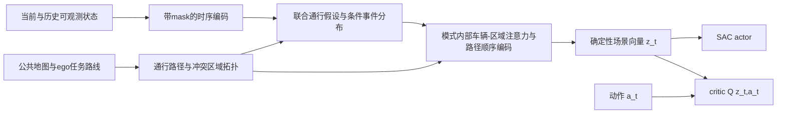

# 面向 SAC 的通行事件图表征：研究路线与可证伪设计

日期：2026-10-03。状态：**方法设计，尚未实现、训练或验证性能**。

后续实施细化见 `implementation_roadmap.md`：当前建议以128维z、3s学习预测起步，M0→M1→M2→M3逐级验证；M3首版采用共享场景latent下的路线/进度混合分布，不把显式joint beam作为前置条件。本文保留概念设计推导和候选扩展，实际阶段/初始配置以该roadmap为准。这是计划细化，不涉及历史实验变更。

用户本次范围：以 `intersection_sorted_depart4p0` 为主场景，允许重新定义环境观测和重构场景编码器，保留 SAC 及 `Q(z_t,a_t)` 接口。此前奖励/事件价值/回放方向保留为学习机制备选，见 `../reward_literature_technical_route_20261003.md`，本轮不同时改动。本文不授权或启动新训练。

证据入口：`environment_evidence.md`、`literature_topology.md`、`literature_interaction.md`、`root_source_notes.md`、`papers.md`；历史结果仍以 `../experiment_history.md` 与原始运行记录为准。

## 1. 结论与主张边界

建议研究的核心问题不是“用两个图替换 MLP”，而是：**在相同可观测信息下，如何避免把对通行决策有不同意义的交互状态压缩成相似的场景表示？**

候选路线是：用公共道路拓扑定义合法通行路径和冲突区域，用历史观测推断若干联合的未来通行可能性；在每个可能性内部，将同一车辆沿同一路径的进入、占用、清空事件联系起来，再通过车辆—冲突区域注意力和沿自车任务路线的顺序编码生成 `z_t`。暂称“通行事件图表征”，不是已发表方法名。

它要检验的主要假设是：**同步几何关系和局部边际风险仍可能遗漏跨车辆、跨区域的占用关联；显式保留这种关联，比堆叠更多 token 或使用平均 TTC 更有助于选择通行时机。** 当前实验尚未证明这种信息确实是成功率瓶颈。若最小验证不支持，应收缩到简单事件图或放弃该假设。

“双图”“图注意力”“未来交互”“多模态预测”“冲突区资源节点”都有先例。加入 SAC 不会自动构成创新。当前只能称一条有依据、值得验证的候选技术路线，不能承诺达到 CCF-A 或某期刊录用标准。

## 2. 主场景给出的约束

以下为本地静态代码/模板事实或已记录实验观察；详细源码位置在 `environment_evidence.md`。

- 单个无信号 J1，四臂、各三条约 70 m 车道；ego 固定从 `-E1_2` 出发，任务为 `-E1 -> -E0` 左转。
- 30 份背景交通模板中只有三类背景 route：`E2 E1`、`-E3 -E0`、`E0 E3`，均为三条进口的直行。`depart4p0` 将发车时间稀疏化；不是丰富的随机意图数据集。
- 当前 Paper 环境无遮挡模型，先能访问当前 active actors，再按欧氏距离和 ID tie-break 保留最近 5 个。policy 张量不直接带车辆 ID。增加邻车数量可能单独带来收益，因此必须有同输入对照。
- 现有 ST-RT 的 social 路径是公开 lane graph 的合法延续候选，不能误称读了邻车未来真实 route。实际调用链虽然经过查询 route 的 helper，但 social SMARTS 路径分支不使用它约束未来路径。ST-RT 的 ego 候选也不等于明确的目标路线条件。
- 旧 ST-RT 与修复 ST-RT 的碰撞集中在路口内部连接器的最后有效记录；这支持研究交汇通行，但不是精确碰撞位置、责任或原因分类。尚无证据认定“下游堵塞”“多区域关联丢失”或“隐含意图不确定”是主要根因。

同场景、seed0、100k raw、最终 100 回合的已记录结果（成功/碰撞/超时）：

| 方法 | S/C/T | 本设计使用它说明什么 |
|---|---:|---|
| SAC+MLP | 22/38/40 | 学会通过路口仍有明显困难 |
| MST+SLT | 53/47/0 | 强基线具备完成任务能力，仍有碰撞瓶颈 |
| 旧 ST | 50/50/0 | 旧实现记录，不能充当修复代码的新结果 |
| 旧 ST-RT | 63/37/0 | 历史路线相关结构有收益迹象，存在 C8/C9 局限 |
| 修复 ST | 45/50/5 | C8/C9 联合修复后的记录 |
| 修复 ST-RT | 52/48/0 | 当前不能声称稳定超越 MST+SLT |

这些是单种子开发结果；反复使用的 validation seeds 10000–10099 不能继续称未见过的最终测试集。旧/修复版差异不识别 C8 与 C9 的各自贡献。

**任务对齐原则**：先验证“哪些车会影响这次左转、何时可能占用交汇空间”。路线不确定、下游堵塞、多交叉口能力只能作为后续泛化维度，不能编造成该主场景已证实的失败原因。单个 J1 可包含多个几何冲突子区，不意味着它是多个交叉口。

## 3. 从近邻方法得到的限制

| 已有方法 | 已覆盖的设计空间 | 本候选不能这样声称 |
|---|---|---|
| GraphAD，IJCAI 2025 | dynamic actor 图、actor-map 图；同 actor 不同 trajectory modes 是不同节点；按同步未来时刻的最小几何距离连边 | 不能声称首次双图、首次 mode 节点或首次有未来时间意识 |
| BeTop，NeurIPS 2024 | 从未来轨迹提取行为拓扑，并指导交互注意力/预测规划 | 不能声称首次未来交互拓扑或首次显式拓扑监督 |
| T2SG，CVPR 2025；SeqGrowGraph，ICCV 2025 | 显式道路连通与拓扑推理 | 地图拓扑本身不是创新；感知指标也不证明 SAC 收益 |
| FINet，ICCV 2025 | 将未来交互信息用于运动预测 | 未来信息辅助编码不是新概念 |
| NEST，AAAI 2025；SWIFT，TPAMI accepted / 2026 author manuscript | 高阶/远近交互、多关系及场景状态调节结构 | 高阶图、动态关系结构也不能单独作为新颖性 |
| RAP，RAL 2026；QCNeXt，2023 | 联合未来与 ego/other role 区分等 | 联合模式或角色 token 不能单独作为贡献 |
| CfDCA，TR-C 2025 | vehicle/conflict-zone 资源图、entry/exit/clearance 和优先级 | 冲突区域节点与进入清空语义不是新发明 |

GraphAD 的距离是 `min_t ||x_i(t)-x_j(t)||`，不是仅当前距离，也不是所有 `t,u` 的跨时刻最小值。这个区别直接影响 novelty 判断。CfDCA 的安全逻辑依赖固定路径、全体 AV 遵从同一协议等假设，不适用于直接给一个 SAC ego 的编码器背书。

主要原文：
- GraphAD：https://www.ijcai.org/proceedings/2025/0270.pdf
- BeTop：https://proceedings.neurips.cc/paper_files/paper/2024/file/a862f5788fd09bb6843c694d8120d50c-Paper-Conference.pdf
- RAP：https://vipl-epp.github.io/pdf/2025RAL-RAP.pdf
- CfDCA：https://transportlab.sydney.edu.au/wp-content/uploads/2025/09/AS-DL-MR-2025.pdf
- NEST：https://ojs.aaai.org/index.php/AAAI/article/view/32064
- SWIFT：https://arxiv.org/abs/2607.09741 （作者稿注明 TPAMI accepted；不是用 arXiv 分类冒充期刊接收）
- QCNeXt：https://arxiv.org/abs/2306.10508 （2023 challenge 技术报告，窗口外；不是 CVPR 主会论文）

更完整的筛选表包含新的高阶/动态关系近邻。检索未发现完全相同方法不等于证明首创；实现前仍应逐式对照 GraphAD、BeTop、QCNeXt、RAP 及冲突图文献。

## 4. 设计迭代：保留什么，否定什么

1. **lane graph + vehicle graph + Transformer**：可作为公平基础编码器，不能作为主要创新，直接被现有工作覆盖。
2. **在车辆边上加入 TTC/风险权重**：仍是局部手工关系增强；单一恒速值丢失变化与不确定性，已有 ConflictTiming 的负结果也不支持继续无条件加字段。否定它作为最终主张，不据此断言所有风险信息无用。
3. **每个车辆—区域独立预测到达/离开时间**：语义更清晰，但可能预测出同一车辆在不相容路径同时出现，或产生不一致的跨区时间；各区域边际概率还不能恢复联合通行可能性。不能只换输出名字。
4. **最终候选：模式内部一致的通行事件图**：一个联合模式中的车辆路径与沿路径进度生成全部相关区域事件；先在该模式内部传播车辆—区域和沿路径信息，再压缩场景。主要贡献候选收缩到这种受物理/拓扑约束的关系表征及其可辨识作用。

这是分析层面的设计迭代，不是声称上述四个版本已经跑过实验。

## 5. 重新定义观测合同

输入仅含当前及过去可观测量、公共地图、ego 已知任务路线：

- ego/邻车：位置、统一 Cartesian 速度、可由历史估计的加速度、朝向、长宽、当前 lane 匹配及置信度、历史时间戳与显式 valid mask。
- 用匿名 tracking key 保持历史连续；不把 SUMO vehicle ID、模板号或发车序号作为可学习输入。未观测历史不能填成零速度；全空、左补、内部缺帧均需正确处理。
- 公共地图：lane geometry、合法 successor/lane-change connection、转向关系、公开优先权/控制状态及可计算冲突几何。禁用背景真实未来 route、未来发车列表、未来碰撞标签作为在线输入。
- ego task route 是合法导航信息；与 background route hypotheses 分开。没有任务路线的 actor 不得被强制朝 ego 目标延伸。
- 观测范围和车辆上限统一对照。首版建议工程起点为 80 m、最多 24 个 actor（含 ego）、2 s 历史，每 0.1 s 一帧；这些不是已证明最优配置。地图检索前视可为 60 m；超范围和超上限均记录覆盖缺口。不要因为代码能访问全网就宣称具备真实传感器可见性。

预测还存在“当前没有被跟踪、未来 6 s 内才入场”的覆盖缺口。首版预测域明确限定为当前可见/有效跟踪集合；公共入口保留 unknown 标记，不读取未来发车安排，也不把未观测入口视为已证实空闲。若后来学习入口占用先验，其数据来源/校准/同输入对照另列，不能在首版假装已解决。

如果提高覆盖或加入 ego navigation，先测同输入 MLP/Set encoder/ST-RT 对照；不能把“给了更多信息”的收益归于图结构。

## 6. 图一：通行路径—冲突区域拓扑

从公共 lane graph 枚举短程合法 movement corridors，包括入口 lane、内部连接器和出口延续。保留几何、弧长、曲率和边界，不把 lane ID 作为语义。

由不同 corridors 的车身扫掠包络构造冲突子区 `c`，记录每条 corridor 在该区域的进入/离开弧长。交叉、汇入、跟驰分开；平行不相交的道路不能仅因距离近就建立 crossing 边。对不相容候选路线保留分支，不提前选定邻车未来目标。

静态图至少有三类关系：合法通行延续、沿 movement 的区域先后、共享空间/汇入关系。一个物理区域可能对应多个 movement。跟驰/侧向邻近保留独立局部关系，不能让冲突区图漏掉追尾和换道风险。

**它的用途是约束“谁可能在什么地方发生关系”**，不是输出安全动作。粗粒度资源区域重叠只能表示潜在冲突，不能直接当真实碰撞。车身尺寸、弯道扫掠、区间连通性和离散时间穿越都要验证。

## 7. 图二：车辆—通行事件交互图

先用带相对时间的 causal temporal attention 编码每车历史，得到 `h_i(t)`。图中使用统一坐标与相对几何，所有有效帧索引基于实际 mask；heading 与速度转换不再复用错误坐标合同。

构造小规模联合假设集合 `k=1..K`，工程起点 `K=4`、未来 6 s、0.3 s 栅格；同时保留未进入/未清空/未知质量，不把远期未知映射为零风险。`K=1` 是必须保留的简化版本。当前场景若几乎不存在可学习多模态，不应通过人为熵奖励强迫它产生多种意图。

每个模式包含各 actor 的公共候选路径及沿路径进度分布。连续前进分支可用非负速度增量积分；停车允许零进度。偏离/换道必须通过合法分支或 unknown 分支表达，不能硬投影后假装模型总是正确。**同一模式中，同一 actor 的所有区域事件必须来自同一条路径和同一进度过程**，而不是为每个区域独立生成时间。

由此得到事件：

`e_(i,c)^k = (path membership, entry interval, clearance interval, occupancy sequence, uncertainty, censor/valid masks)`。

显式使用“占用/进入/清空”名称。不是把 CPA 时间、恒速 ETA 或资源重叠概率称为真实 TTC 或碰撞概率。

同一模式内的消息路径：

`actor history → legal movement → conflict zone → other actors → next zones on the same movement`。

例如区域聚合可写为 `α_ic^k = softmax_i(q_c^T k_i / sqrt(d) + bψ(e_(i,c)^k, relation_type))`，再沿 movement 的区域顺序传播。静态合法关系提供候选范围，时间与不确定性作为关系特征；不是先用一个预测风险阈值删除其余车辆。单个区域关联多个车辆时，factor node 可聚合多方关系；“用了高阶关系”本身已有 NEST 等先例。

注意力的关系项依赖相对进入/清空时间、车身覆盖、path compatibility 和观测不确定性；ego task route 只用于 ego 的查询。保留直接跟驰/邻近分支作为覆盖兜底，不能只靠硬筛选把未知风险删掉。

注意：结构一致性只约束**同一车辆的自身路径/时间**。不得强制所有背景车互不冲突、服从通行优先级或为 ego 让行；这些恰好是需要预测的行为。交互边不是因果边，attention 权重也不是责任解释。

## 8. 联合模式与 z 的读出

一个可实施的初版概率近似是：

`p(Y | H_t, G) = Σ_k π_k(H_t,G) ∏_i p(Y_i | k,H_t,G)`。

`Y_i` 是可观察的未来路径进度/占用事件。模式权重是**场景共享**的，而不是任意将各车辆第 k 个独立预测模式视作共同世界；给定模式后的条件独立残差是明确近似。模式数有限，不能声称恢复真实联合分布。

首版的未来随机量只针对背景 actors；ego 保留当前/历史运动和已知目标路线作为查询，不把预测出来的 ego 行为当作当前候选动作的后果。联合路径假设不能靠拼接各 actor 的 mode 序号得到：需从一个联合解码器产生路径组合，再对每个组合生成进度。实现可用有预算的 joint beam，路径组合在模式内保持离散互斥；被裁剪的质量和未覆盖路线标为 unknown。离散选择不假装可微，可由事实标签的路径 likelihood 训练，SAC 不通过 hard graph selection 反传。连续事件特征和 encoder 的梯度路径仍须单独说明和测试。固定直行主场景先从已观测路径明确的 K=1 起步；复杂 joint beam 只有通过数据可学性门槛后才加入。

明确实现选择：在线和 SAC replay forward 都使用**确定性的条件分布参数表示** `Ξ^k`，不随机抽一条未来轨迹，也不将多条路线取坐标均值。`Ξ^k` 保留模式的离散路径组合、沿路径进度过程参数、区域进入/清空分布、删失/unknown 质量；不是每个区域独立的均值 ETA。一个可检查的实现是有序离散进度状态及前进/停留转移核，区域事件从同一个进度过程导出；跨区转移/条件关系本身也进入编码器，不能只输出其边际 occupancy 序列。Markov 运动模型本身已有先例，不列为创新。

设模式内部图输出 `g_k = EventGraph(H_t,G,Ξ^k)`。先形成模式内部沿 ego 路线的占用关系摘要，再用固定数量的 learned readout queries 对 `{(π_k,g_k)}` 做集合读出，得到固定维向量 `z_t`。使用多个读出 token 可表达不同通行时间段，并保留未知质量、ego 状态与局部几何旁路。路径组合由公共候选与联合解码器确定，预算剪枝及相同分数 tie-handling 必须通过 actor 重排测试；不能使用 tracking ID 打破学习层的语义对称性。若做采样仅用于离线评分/检验，不能未经说明让同一 observation 的策略特征因 Monte Carlo 随机数而改变。

**禁止先平均各 actor 轨迹/每条风险边再构图**，但也不能宣称任意有限维 pooling 都无损。应对“mode-before-graph averaging”“event-independent outputs”“within-mode structure shuffle”做实际可辨识性消融；最后若读出仍混淆关键状态，需要改读出，而不是继续增加 encoder 层数。

最终接口保持：

`z_t = fθ(observations_≤t, public_map, ego_route)`

`a_t ~ πφ(a | z_t)`

`Q_j = Qψj(z_t, a_t), j=1,2`。

`z_t` 不读取实际未来动作/轨迹或即将采样的当前动作。首版可选 hidden width 128、4 heads、2 层关系编码、`z_dim=256`；必须报告实际参数、峰值显存、建图+推理延时。这些是小规模实现起点，不是文献证明的最佳值。

## 9. 表征如何获得监督，而不改奖励和回放

保留 SAC 的动作、reward、replay sampling、target 和优化步预算；对新表征附加预测训练信号是**表征目标的变化**，必须单独消融，不应伪称“完全只改网络结构”。

建议仅从正常训练后来发生的观测提取路径进度和进入/清空标签，训练联合预测分布的 masked/censored likelihood，并验证事件级 Brier/NLL 与联合校准。若使用额外 occupancy BCE，它只约束边际，不证明学到联合依赖。不要直接用强制安全/让行损失优化背景预测，否则可能把“希望背景让”训练成“预测背景会让”。RAP 对 ego/others 目标区分是这一限制的近邻依据。

车辆消失、观察范围外移、回合结束和预测时域截止需区分。已观察到 entry 但未观察到 clearance 时保留 entry 信息；不把删失当作未来永不占用。只接受可观测真值，不读取未来 route 来补全标签。

长时域标签来自当时行为策略及其未来动作，不是当前 `a_t` 的反事实。背景可能响应 ego，且策略会变化，因此不能把 `p(Y|H_t,G)` 当动作无关的真实环境模型或安全保证。主设计只把它作为可验证的场景预测特征，由真实交互的 Q 学习动作结果；按策略阶段和反应式背景检查漂移。

若漂移明显，应先缩短预测时域，或采用辅助解码器 `D(z_t,a_t) → observed next event` 验证状态表征的动作条件可预测性。辅助训练可读取已执行的 `a_t`，在线编码器依然只输出 state-only `z_t`。不要未经覆盖检验就扩展为长动作序列的反事实世界模型。

这里的动作条件监督仍只有已执行动作的 factual evidence，不识别未执行动作后果。校准至少按行为策略/checkpoint 阶段、进入路口前/区内、时间跨度分层；不同阶段 replay 的长未来标签不能不加检查地视为同一稳定分布。

loss 示例为 `L_Q + λ_pred L_joint_event` 更新 encoder；actor/encoder 的梯度合同固定并公开，例如沿用现有 actor 对共享特征 stop-gradient。记录两路梯度尺度/夹角和事件校准，防止 Q 梯度将概率头变为不再校准的任意隐码。λ 只能在训练/开发集上选择。

bootstrap 和 timeout 的已知协议问题保留在独立工程轨道处理；本研究不能一边修 SAC target、一边换输入/encoder，再将提升全归为表征。在任何正式论文协议中应统一审计后的 SAC 实现，重新生成同协议对照；历史数字保留。

## 10. 理论依据能够支持到哪里

### 10.1 可检查的结构性质

- 若每个 actor 的多区域事件由同一路径和同一进度过程导出，则其区域到访序列不能违背该路径的拓扑顺序；允许相邻区域占用区间因车身长度而重叠，不能错误要求 `clear(c1) < enter(c2)` 对所有相邻区域成立。
- 只用相对位置/相对朝向/统一 Cartesian 速度、弧长和时间，并对集合使用共享函数与对称读出，可构造车辆重排不变及全局平移/旋转不变的标量 `z`。这是设计合同，仍须对完整实现测试；不包括镜像不变，因为左右交通规则可能不同。
- 假定冲突区域对给定 paths/body footprints 完整覆盖：两车若不在任何共同区域同时占用，可排除这些区域内的相撞；反过来，同区同时占用不必然发生碰撞。这只说明资源表示与风险相关，不保证实际 SAC 安全。

### 10.2 为什么仅边际风险可能不够：可精确验证的反例

令 `X1,X2` 表示 ego 两个对应通行时间窗是否可用。分布 A 为 `(0,0)` 与 `(1,1)` 各一半；分布 B 为 `(0,1)` 与 `(1,0)` 各一半。两者各边际 `P(X1=1)=P(X2=1)=0.5` 完全相同，但 `P(X1=X2=1)` 分别为 `0.5` 和 `0`。

因此，**仅保留两个边际数值的表示无法区分这两个联合通行条件**。模式内部先计算关系，再做概率集合汇聚有机会保留差异。这个反例不证明 GraphAD/BeTop 必然丢失该信息，也不证明当前主场景存在此类频繁状态；它只是明确本候选应该在哪类可控案例里胜出。验证脚本 `check_event_representation_counterexample.py` 只算这个合成反例，不运行 SUMO。

2026-10-03 已用项目固定 Python 运行该脚本：两组边际均为 0.5，联合可用概率分别为 0.5/0.0，断言通过。此结果是精确合成计算，不是模型性能或交通实验。

### 10.3 不作的理论承诺

不声称 `z_t` 是严格 Markov sufficient statistic、学到真实因果结构、得到校准安全保证或必然提高成功率。新架构的收益取决于覆盖、预测误差、压缩、策略适应和数据量；这些需要实验。

## 11. 最小验证与放弃条件

| 顺序 | 只回答一个问题 | 比较/检查 | 失败后怎么做 |
|---|---|---|---|
| 0 合同 | 图是否表达正确物理关系 | 交叉/错时交叉/汇入/追尾/平行/停车；尺寸扫掠；全空与缺帧；旋转/ID重排；非法路径与 unknown | 修实现，不训练 |
| 1 表示可辨识性 | 是否保留跨区/模式关系 | 固定合成状态的联合反例；平均边际 vs mode内编码；参数近似匹配 | 若不能区分，重做读出；不扩大网络 |
| 2 数据可学性 | 主场景是否有这种困难且能从历史识别 | 正常轨迹的邻车筛选漏覆盖、冲突区事件覆盖、确定性恒速/恒加速度与 learned 单模式/联合模式的校准和误差 | 若固定流几乎确定，保留单模式，不能硬造多模态贡献 |
| 3 同输入小规模闭环 | 收益来自输入还是事件结构 | 通用双图attention对照 vs事件图；同观察范围/ego路线/参数预算；先少量开发种子与冻结paired cases | 若只有扩输入收益，结论就是输入改进；不能归图创新 |
| 4 正式开发训练 | 新结构是否提高成功而不增加停滞 | seed0从零100k可作首轮；两worker跑同输入对照+最小事件版本；冻结奖励/SAC协议 | 校准改善但S不升：查z读出/Q利用及策略影响，不继续堆模块 |
| 5 论文证据 | 是否可重复且迁移 | 多种子、未反复调参的held-out traffic、路口几何/route/车流泛化，学习曲线/延时/参数 | 单地图单seed仅是开发证据 |

上述是建议的下一步，不表示本次已启动。旧日志没有完整的新输入序列，不能声称凭现有汇总就能离线训练这一模型；需要在后续获授权的正常运行中增加采集。

最关键的消融是：同输入通用关系attention；显式事件语义但单模式；联合事件图；独立区域预测替代同路径生成；仅边际/模式平均替代模式内传播；去掉辅助监督；同一预测器分别接通用图与事件图。后一比较用于排除“只因为预测器更强”的解释。图结构与额外未来监督不要同时变化而不设对照。

已有 MST+SLT、SAC+MLP、修复 ST-RT 仍应保留；GraphAD-style/BeTop-style 的适配编码器要注明是受论文启发的同输入重实现，不将 SUMO 适配结果冒称论文原结果。

## 12. 正常训练/评估需要增加的证据

优先随正常流程采集，不以额外仿真替代基础日志：

- 观测与图覆盖：输入actor数、被截掉的潜在冲突actor、合法路径枚举/截断原因、有效/未知zone、每种关系边数、模型建图时间；不只记录attention。
- 预测校准：每个独立 `(episode,actor,zone,passage)` 的entry/clearance、重复预测anchor、删失类型、轨迹偏离、模式覆盖/概率、联合事件评分；不可把连续帧当独立样本。episode级bootstrap只是评估不确定性，不能替代训练多seed。
- 表征利用：同状态清除时间信息、交换模式关联且保持边际、去掉跨区边，对动作和 Q 排序的影响；probe只证明功能依赖，需配合真实闭环结果。只置零导致OOD的probe不能单独作机制证据。
- 任务过程：ego进入/清空区的时刻、碰撞第一事件的ego/partner同tick物理状态、目标/实际速度及车道、停止/重新起步阶段、任务route可达性、超时位置；将entry错误、区内处理失败、几何偏离和不必要等待作为可核查分类，不凭最后lane替代接触点。
- 优化：各编码分支梯度/真实更新、预测loss与TD loss尺度/夹角、mode collapse、校准随训练阶段变化，actor是否使用完整z、训练/评估观测一致性。

## 13. 创新与可行性判断

潜在论文主线可以表述为：**把交叉口交互从几何近邻关系重写成受道路拓扑约束、保留联合通行假设的占用事件关系，并验证这种结构如何减少对不同通行条件的表征混淆。**

可争取的贡献是一个明确表示问题、一个有可检查结构约束的编码机制、以及跨场景的可辨识性与闭环证据；不是新增模块清单。若最终仅为把若干 ETA 拼入 GAT，应降低新颖性判断，不能包装成该贡献。

技术可实施：公共SUMO地图/当前状态足够构建图；未来自监督可来自正常训练；二维路口、短时域、小K与稀疏factor messages适合现有两worker规模。数据/方法风险仍高：100k不足以预设学成复杂联合预测，固定三条直行流不充分检验路线多模态，背景响应ego导致未来标签随策略变化，细粒度冲突几何和mode读出也可能丢信息。

建议首轮实现只到“正确观测合同 + 通用双图基线 + 同一路径事件生成/读出”，先通过上述前三级门槛，再决定是否值得训练完整联合模式版本。论文阶段应加入多个交叉口布局、不同背景turning mixtures、密度/速度/驾驶风格及有限观测变化；不要求它们全在当前主场景中发生。

期刊等级只使用核验过的官方年度目录；本次不把 JCR Q1、CAS二区Top 或 CCF-A 混为一谈。论文清单提供准确 venue/source，不能由 venue 倒推出我们的路线已经达到同样标准。
