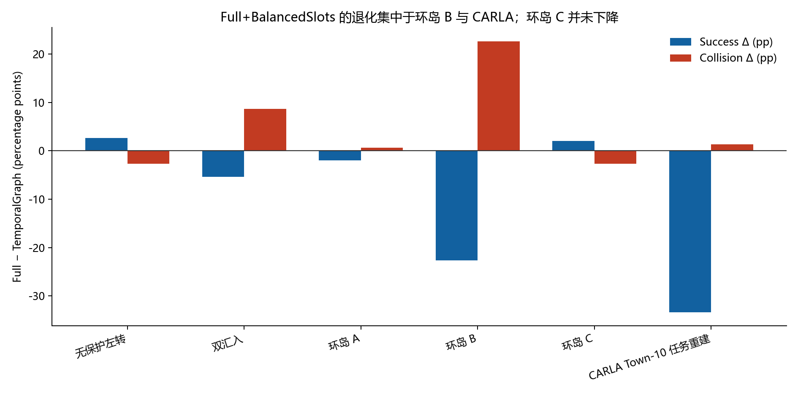
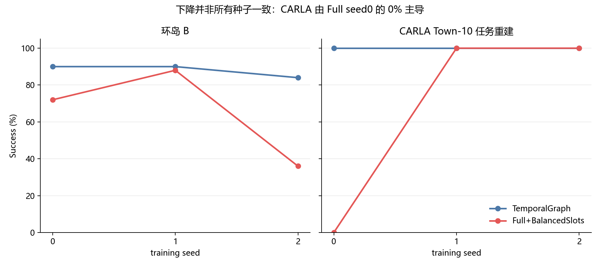

# Full+BalancedSlots 场景退化诊断（冻结矩阵，只读）

## 结论先行

**当前证据支持 Full+BalancedSlots 存在结构性缺陷，但不支持“这些场景不适配，应当替换场景”。** 环岛 A/B/C 的发布 SUMO 资产、拓扑容量和目标可达性均通过审计；双汇入也可达，但当前拓扑构造没有任何 `conflict` 边，属于模型侧关系表达缺口。CARLA 可作为 Town-10 左转/目标车道任务的受控 SUMO 重建，但不能称为原 CARLA 地图与动力学的直接移植，且只有一个交通 XML，train/evaluation 资产不互斥。

从 TemporalGraph 到 Full 同时增加 topology query 和 non-affine BalancedSlots，因此冻结矩阵本身**不能把退化单独归因给其中一个组件**。最强证据链是：拓扑注意力在复杂地图上过于弥散；路线 token 被 42–44 个拓扑 token 稀释；软拓扑注意力又被乘进 same-lane/conflict 特征；BalancedSlots 抹去幅值/置信度却没有改善跨 batch 的 slot 平衡；在稀疏终端奖励和 ±1/3 离散横向阈值下，部分种子最终锁死为单一横向符号。

## 1. 先纠正一个事实：环岛 C 没有退化

| 场景 | TG Success | Full Success | ΔSuccess | ΔCollision | ΔTimeout | ΔReturn |
| --- | --- | --- | --- | --- | --- | --- |
| 无保护左转 | 95.3% | 98.0% | +2.7% | -2.7% | +0.0% | +0.053 |
| 双汇入 | 82.7% | 77.3% | -5.3% | +8.7% | -4.7% | -0.140 |
| 环岛 A | 96.7% | 94.7% | -2.0% | +0.7% | +1.3% | -0.027 |
| 环岛 B | 88.0% | 65.3% | -22.7% | +22.7% | +0.0% | -0.453 |
| 环岛 C | 81.3% | 83.3% | +2.0% | -2.7% | +0.7% | +0.047 |
| CARLA Town-10 任务重建 | 100.0% | 66.7% | -33.3% | +1.3% | +32.0% | -0.347 |

环岛 C 的 Success 实际为 **81.33% → 83.33%（+2.00pp）**，Collision 为 **−2.67pp**；因此退化集合应写成“双汇入、环岛 A、环岛 B、CARLA”，而不是 A/B/C 全部下降。环岛 B 是最清楚的场景级退化（Success −22.67pp、Collision +22.67pp，分层 bootstrap 95% 区间分别为 [−47.33, −2.00]pp 与 [+2.00, +46.67]pp）。CARLA 的 −33.33pp 则由 Full seed0 的 0% 成功率主导，只有 3 个训练种子，置信区间仍触及 0。

## 2. 场景是否有问题、能否视为原场景的 SUMO 迁移版

| 场景 | 迁移判定 | 流量持出互斥 | 可达性 | 审计结论/限制 |
| --- | --- | --- | --- | --- |
| 环岛 A | 可视为原 SMARTS 场景的直接 SUMO 资产迁移 | True | PASS | 无资产破损；但 A/B/C 不是只改变密度的单因子难度阶梯 |
| 环岛 B | 可视为原 SMARTS 场景的直接 SUMO 资产迁移 | True | PASS | 无资产破损；但 A/B/C 不是只改变密度的单因子难度阶梯 |
| 环岛 C | 可视为原 SMARTS 场景的直接 SUMO 资产迁移 | True | PASS | 无资产破损；但 A/B/C 不是只改变密度的单因子难度阶梯 |
| CARLA Town-10 任务重建 | 只能称为 Town-10 任务语义重建，不能称为原 CARLA 地图/动力学直接迁移 | False | PASS（含强制目标车道变换测试） | 只有一个交通 XML，train/evaluation 资产不互斥；仍有 SUMO seed 随机性 |

### 环岛 A/B/C

- 三者 `map.net.xml` 完全相同（SHA256 `9C23D52E...47E3`），且都来自作者发布包，可称为原 SMARTS 场景的直接 SUMO 资产迁移。
- 但“等价”只覆盖任务语义、观测/动作接口、奖励/终止和控制频率，不是 SMARTS 物理、碰撞求解或传感器的 bitwise 等价。
- A/B/C 不是干净的密度阶梯：A/B/C 的 ego route、主流量率、特殊流、交通 XML 数和时限都不同。名义配置流量总和约为 820/950/450 veh/h，B 反而最密；C 路线最长、时限更长。因此不能把 A→B→C 的差异只解释成“难度/密度逐级增加”。
- 发布目录里 A/B/C 分别有 30/40/15 个交通 XML；冻结划分为 24/6、32/8、12/3，互斥且各方法配对。A/B 比源码生成循环的 15/20 更多，属于发布资产目录现状，不是本次迁移凭空生成的数据。

### CARLA Town-10

- 它从发布的 `carla_env.py`、`wp.npy`、`wp2.npy` 恢复起点、曲线、目标车道、终点框、302-step 上限以及车辆/行人交互语义；目标可达和必须换入目标车道的测试通过。
- 但原 CARLA 没有发布可直接运行的 SUMO 路网。当前 `map.net.xml`、交通流和行人流是新建的 SUMO proxy，因此正确标签是 **`carla_source_waypoint_reconstruction` / controlled extension**，不是 Town10HD_Opt 地图移植。
- 只有 `traffic_0.rou.xml`：代码明确在 train/evaluation 都复用它并公开 `traffic_partition_is_disjoint=false`。SUMO seed 会改变随机速度、驾驶噪声与随机出发位置，但这不是 held-out traffic-asset 泛化。该限制会缩小外部有效性，却不能解释 Full seed0 失败而 TemporalGraph 同种子成功，因为两方法收到相同配对环境。

## 3. 拓扑图审计：没有截断，但语义并不完整

| 场景 | Nodes | Edges | Conflict edges | 容量通过 |
| --- | --- | --- | --- | --- |
| 无保护左转 | 17 | 62 | 20 | True |
| 双汇入 | 10 | 18 | 0 | True |
| 环岛 A | 44 | 160 | 40 | True |
| 环岛 B | 44 | 160 | 40 | True |
| 环岛 C | 44 | 160 | 40 | True |
| CARLA Town-10 任务重建 | 42 | 142 | 36 | True |

所有图均低于 64 nodes/256 edges 的容量，没有静默截断。A/B/C 共享同一 44-node/160-edge 指纹。真正的问题是**关系定义**：双汇入只有 successor/predecessor/left/right，`conflict=0`。实现只用 SUMO junction `areFoes()` 生成冲突关系，无法表达两个车流在下游合并到同一车道的“merge conflict”。Full 因此增加了拓扑复杂度，却没有获得该场景最关键的安全关系。

## 4. Full+BalancedSlots 的具体缺陷

### 4.1 对比是联合改动，当前设计不可识别单组件因果

配置中 `temporal_graph` 同时关闭 topology，而 `topo_scene_balanced` 同时开启 topology 和 slot normalization。由此只能说“完整组合退化”，不能断言单独是 topology 或 BalancedSlots。

### 4.2 拓扑查询过于弥散，且误差被二次传播

lane query 只有学习得分加固定 20 m 高斯距离偏置，没有显式路线归属、行驶方向兼容或候选车道门控。复杂图中的平均熵对应约 4–8 条有效候选 lane；Full 的场景去均值 entropy 与 success 的描述性相关为约 −0.46。随后 same-lane/conflict 又由两个软注意力概率相乘得到，弥散误差会进入车辆图边特征。

### 4.3 路线 token 被拓扑 token 数量稀释

最终 goal attention 把 ego route token 与全部 topology token 直接拼在一个池中，没有 token 类型门、层级池化或 cardinality correction。等分注意力时，路线 token 占比只有：双汇入 2/(2+10)=16.7%，A/B/C 2/(2+44)=4.35%，CARLA 3/(3+42)=6.67%。这使模型容易依赖静态地图数量而非任务路线，尤其伤害需要正确横向符号/目标车道的 B 与 CARLA。

### 4.4 BalancedSlots 不是“跨样本平衡器”

32/64/32 三段分别做 non-affine LayerNorm，会在每个样本内强制零均值/单位方差，删除幅值和置信度；它并不保证不同 slot 在 replay batch 上具有相等信息量。冻结诊断中 Full 的总体 latent std 约 0.292，而 TemporalGraph 约 0.906；Full 的跨 batch slot-scale ratio 约 4.96，反而高于 TemporalGraph 的 3.05。这个证据提示表征压缩/塌缩，但相关性不足以单独证明它就是唯一原因。

### 4.5 固定预算下容量增大并造成种子敏感

Full 约 2.017M 参数，TemporalGraph 约 1.438M（+40.2%）；learner update 约 +47%、推理约 +87%、峰值 GPU 约 +52%。两者仍固定为 100k raw steps、约 95k updates。更大而更复杂的模型在稀疏 `success − collision` 终端奖励下更容易欠识别，并把小的 critic/注意力误差放大成不同 seed 的策略分叉。

### 4.6 失败策略出现离散横向动作符号饱和

环境把连续横向动作在 ±1/3 处离散成 −1/0/+1。只读同 seed rollout 显示：CARLA Full seed0 的 92.1% 决策为正向命令、均速仅 2.17m/s，最终 302-step timeout；同 seed TemporalGraph 100% 为反向命令，93 steps 成功。环岛 B Full seed2 则 100% 为正向命令并碰撞；同场景成功的 Full seed1 有 94.6% 反向命令。这不是“地图不可解”，而是 Full 在部分初始化下锁死为错误的路线/横向策略。

| 只读轨迹 | 结果 | Mean speed | Cmd − | Cmd 0 | Cmd + |
| --- | --- | --- | --- | --- | --- |
| paper__full_balanced__carla__seed0 | timeout | 2.17 | 5.0% | 3.0% | 92.1% |
| paper__full_balanced__carla__seed1 | success | 7.60 | 39.4% | 60.6% | 0.0% |
| paper__temporal_graph__carla__seed0 | success | 8.88 | 100.0% | 0.0% | 0.0% |
| paper__full_balanced__roundabout_medium__seed2 | collision | 8.04 | 0.0% | 0.0% | 100.0% |
| paper__full_balanced__roundabout_medium__seed1 | success | 4.39 | 94.6% | 0.7% | 4.7% |
| paper__temporal_graph__roundabout_medium__seed2 | success | 6.84 | 44.3% | 13.4% | 42.3% |
| paper__full_balanced__roundabout__seed2 | success | 6.22 | 100.0% | 0.0% | 0.0% |
| paper__full_balanced__cross__seed1 | success | 6.81 | 25.8% | 28.0% | 46.2% |
| paper__temporal_graph__cross__seed1 | success | 6.53 | 51.1% | 17.3% | 31.7% |

## 5. 为什么各场景表现不同

- **双汇入：** 最关键的 merge-conflict 没被 topology graph 编码；Full 成功回合更快但 Collision +8.67pp，表现像风险偏好/错误安全关系，而非场景损坏。
- **环岛 A：** 图 token 多、路线 token 占比低，但任务短、成功率已接近饱和；下降只有 −2pp，属于弱退化。
- **环岛 B：** 名义流量最高、路线需穿越更长的环岛部分；错误 lane/route attention 更容易直接变成碰撞。Full seed2 的 36% success/64% collision 是主要失败，但碰撞分布跨全部 8 个 evaluation XML，不是一个坏 traffic file。
- **环岛 C：** 并未下降。它的路线更长但名义流量更低；Full 某些“单一横向符号”策略仍可能沿任务路线工作，因此不能把图复杂度机械等同于退化。
- **CARLA：** 必须从转弯后换入指定目标车道，对横向符号极敏感；同时只有一个 traffic asset。Full seed0 的高 topology entropy、低速和错误符号锁死造成 timeout，而另两个 Full seed 为 100%，说明主要是优化/表征不稳定，不是场景普遍不适配。

## 6. 是否需要另外设计场景

**不应替换现有场景。** 一个基准暴露模型缺陷，恰恰说明它有诊断价值；为了让 Full 看起来更好而另换场景会形成选择性报告。现有 A/B/C 与双汇入应继续作为主矩阵；CARLA 应保留但降格为“受控 SUMO proxy”，与直接 SMARTS 资产分栏解释。

如果目标是回答“究竟哪一组件有问题”，可以在不改现有主结论的前提下新增**诊断场景/正交实验**：

1. 在现有场景做 2×2：无 topology/无 norm、topology/无 norm、无 topology/有 norm、topology/有 norm。
2. 同一环岛地图、同一路线、同时限，只改变 450/700/950 veh/h，消除 A/B/C 当前混杂。
3. 双汇入显式加入 merge-conflict 关系并与现有 `areFoes` 图配对，保持交通不变。
4. 目标 token cardinality stress：保持任务相同，只添加 10/20/44 条无关远端 lane，检查 token 数泄漏。
5. CARLA proxy 做目标换道 on/off、行人 on/off、左右镜像配对；并明确 train/eval 都使用同一 traffic XML。
6. 环岛 B 与 CARLA 至少扩到 10 个预注册训练 seeds；若要判断 100k 是否欠训练，预注册 100k/200k/500k 学习曲线，不能事后挑最好预算。

这些是**补充诊断**，不是重新设计一个偏向 Full 的主 benchmark。

## 7. 统计边界

- 每格只有 3 个训练 seeds；50 回合 bootstrap 不能替代新的训练重复。
- 环岛 B 的方向最稳；CARLA 的均值下降由单个 seed 主导，不能称为“系统性不兼容”。
- 宏观 Full−TemporalGraph 为 Success −9.78pp、Collision +4.67pp，但 Holm 校正后不显著。
- Full 与 TemporalGraph 的联合改动使组件级因果未识别；上述机制判断是代码结构、训练诊断与 rollout 行为一致的证据链，而不是已经完成的正交因果证明。

## 证据入口

- 冻结运行表：`../systematic_matrix_deep_attribution_20260814/tables/run_level_metrics.csv`
- 场景级 bootstrap：`../systematic_matrix_deep_attribution_20260814/tables/scenario_attribution.csv`
- 拓扑审计：`../../artifacts/contracts/topology_scan_recheck.json`
- 只读 rollout：`tables/selected_rollout_traces.json`
- 本报告伴随表：`tables/full_vs_temporal_by_scene.csv`、`tables/full_vs_temporal_by_seed.csv`、`tables/scenario_validity_audit.csv`、`tables/topology_audit.csv`
- 研究方法修改：**否**。
