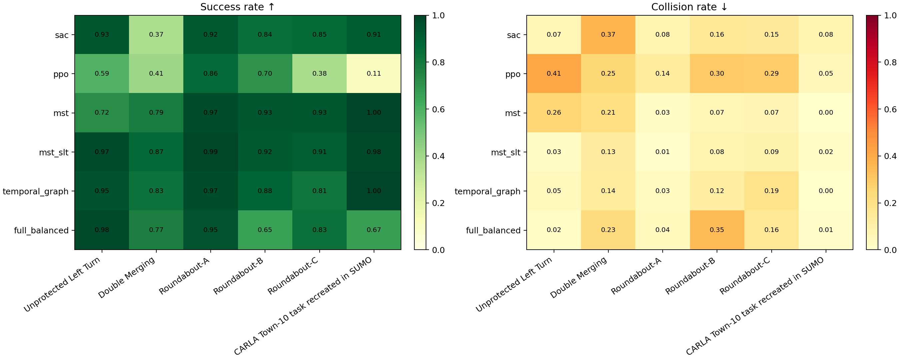
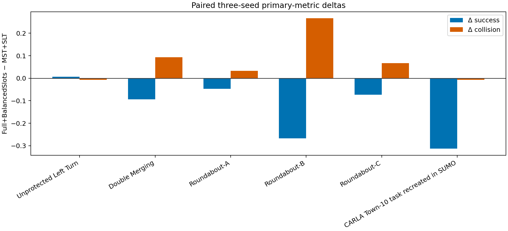

# 六方法 × 六场景系统实验报告

Profile: `paper`
Matrix complete: `true`
Accepted runs: 108/108

## 主结果

| 场景 | 方法 | Success ↑ | Collision ↓ | Return ↑ |
|---|---|---:|---:|---:|
| left_turn | sac | 0.933 | 0.067 | 0.867 |
| left_turn | ppo | 0.587 | 0.413 | 0.173 |
| left_turn | mst | 0.720 | 0.260 | 0.460 |
| left_turn | mst_slt | 0.973 | 0.027 | 0.947 |
| left_turn | temporal_graph | 0.953 | 0.047 | 0.907 |
| left_turn | full_balanced | 0.980 | 0.020 | 0.960 |
| cross | sac | 0.373 | 0.367 | 0.007 |
| cross | ppo | 0.413 | 0.253 | 0.160 |
| cross | mst | 0.787 | 0.213 | 0.573 |
| cross | mst_slt | 0.867 | 0.133 | 0.733 |
| cross | temporal_graph | 0.827 | 0.140 | 0.687 |
| cross | full_balanced | 0.773 | 0.227 | 0.547 |
| roundabout_easy | sac | 0.920 | 0.080 | 0.840 |
| roundabout_easy | ppo | 0.860 | 0.140 | 0.720 |
| roundabout_easy | mst | 0.967 | 0.027 | 0.940 |
| roundabout_easy | mst_slt | 0.993 | 0.007 | 0.987 |
| roundabout_easy | temporal_graph | 0.967 | 0.033 | 0.933 |
| roundabout_easy | full_balanced | 0.947 | 0.040 | 0.907 |
| roundabout_medium | sac | 0.840 | 0.160 | 0.680 |
| roundabout_medium | ppo | 0.700 | 0.300 | 0.400 |
| roundabout_medium | mst | 0.933 | 0.067 | 0.867 |
| roundabout_medium | mst_slt | 0.920 | 0.080 | 0.840 |
| roundabout_medium | temporal_graph | 0.880 | 0.120 | 0.760 |
| roundabout_medium | full_balanced | 0.653 | 0.347 | 0.307 |
| roundabout | sac | 0.853 | 0.147 | 0.707 |
| roundabout | ppo | 0.380 | 0.287 | 0.093 |
| roundabout | mst | 0.927 | 0.073 | 0.853 |
| roundabout | mst_slt | 0.907 | 0.093 | 0.813 |
| roundabout | temporal_graph | 0.813 | 0.187 | 0.627 |
| roundabout | full_balanced | 0.833 | 0.160 | 0.673 |
| carla | sac | 0.913 | 0.080 | 0.833 |
| carla | ppo | 0.107 | 0.053 | 0.053 |
| carla | mst | 1.000 | 0.000 | 1.000 |
| carla | mst_slt | 0.980 | 0.020 | 0.960 |
| carla | temporal_graph | 1.000 | 0.000 | 1.000 |
| carla | full_balanced | 0.667 | 0.013 | 0.653 |

## 预声明宏观对比

| 对比（左−右） | ΔSuccess | ΔCollision | ΔReturn | 归因分类 |
|---|---:|---:|---:|---|
| mst_minus_sac | 0.083 | -0.043 | 0.127 | directionally_positive_without_safety_tradeoff |
| mst_slt_minus_mst | 0.051 | -0.047 | 0.098 | directionally_positive_without_safety_tradeoff |
| temporal_graph_minus_mst_slt | -0.033 | 0.028 | -0.061 | directionally_worse_with_safety_regression |
| full_balanced_minus_temporal_graph | -0.098 | 0.047 | -0.144 | directionally_worse_with_safety_regression |
| full_balanced_minus_mst_slt | -0.131 | 0.074 | -0.206 | directionally_worse_with_safety_regression |
| ppo_minus_sac | -0.298 | 0.091 | -0.389 | directionally_worse_with_safety_regression |

## 归因边界

`TemporalGraph → Full+BalancedSlots` 同时改变拓扑查询与槽位归一化，不能单独识别拓扑贡献。PPO/SAC 对比也不是单组件消融。统计、诊断和效率证据不一致时，以不支持因果解释处理。

